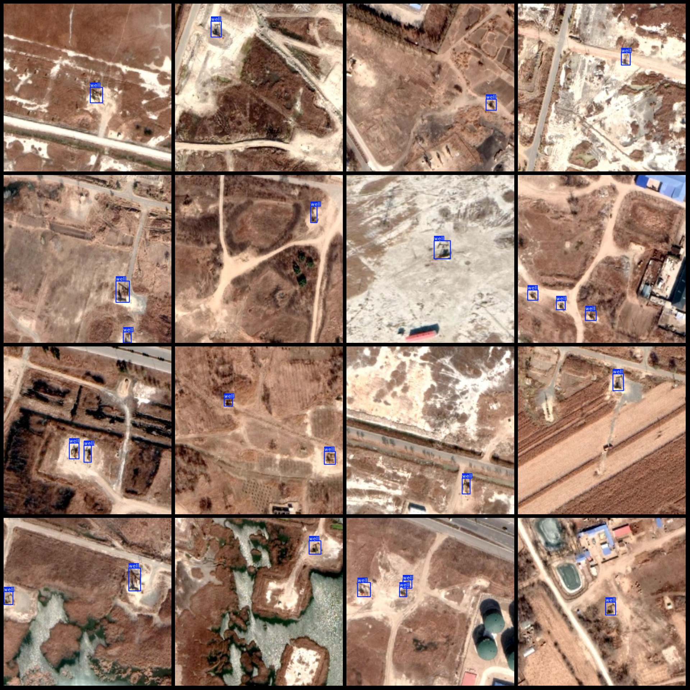
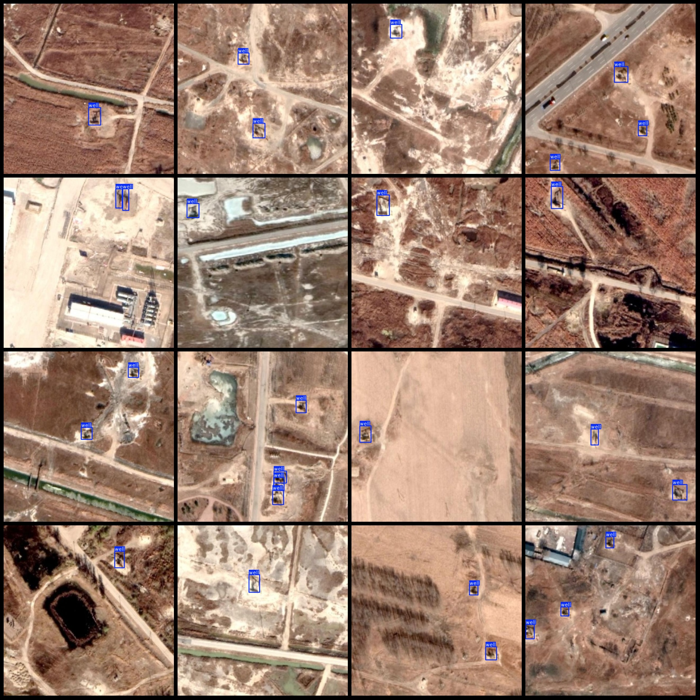
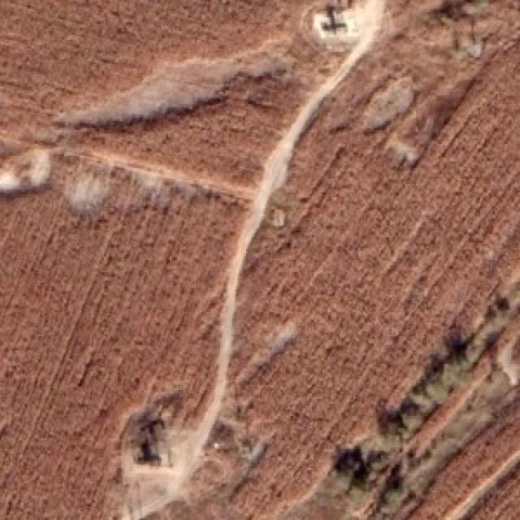
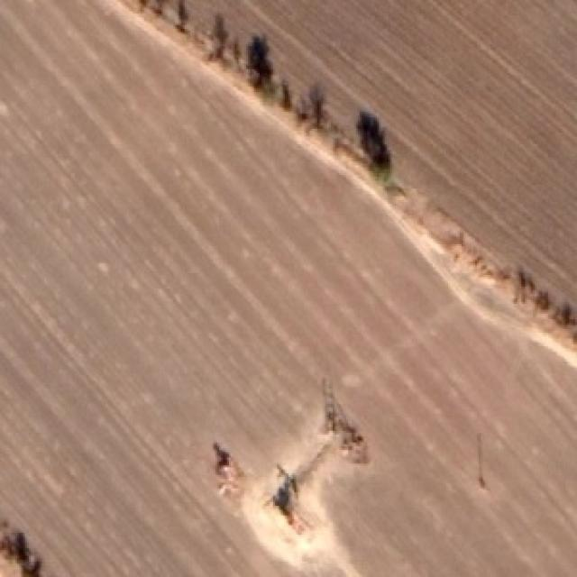
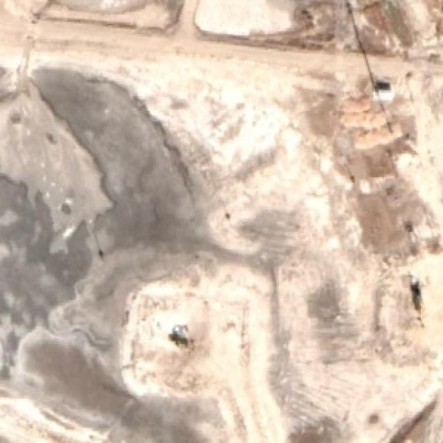
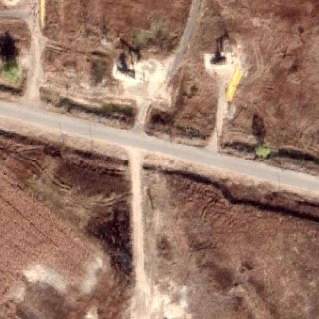

# Remote Sensing Image Well Detection Dataset VOC+YOLO Format with 3473 Images in 1 Category

Please note that the images are generally not very clear; please review the images.
Dataset format: Pascal VOC format + YOLO format (excluding the segmentation path's txt file, only containing jpg images along with corresponding VOC format xml files and YOLO format txt files)
Number of images (number of jpg files): 3473
Number of annotations (xml file count): 3473
Number of annotations (txt file count): 3473
Number of annotation categories: 1
Annotation category name: "well"
Number of bounding box per category:
well = 6926
Total bounding boxes: 6926
Number of images per category:
well = 3473
Image resolution: 640x640
Annotation tool used: labelImg
Annotation rules: draw a rectangle around the category
Important note: The dataset does not have been split into training, validation, or test sets; you need to do so yourself.
Special statement: This dataset does not guarantee the accuracy of the trained models or weight files.
Image preview:
Example of annotation:
Original image example (mainly for clarity, the overall dataset is similar)

## Images

Here is a pay link on Stripe ( https://buy.stripe.com/3cs8yP7sY87d0vu9AB ). Please contact me lonlonago@foxmail.com after funding $89, and I will send you a complete data files , thank you!

